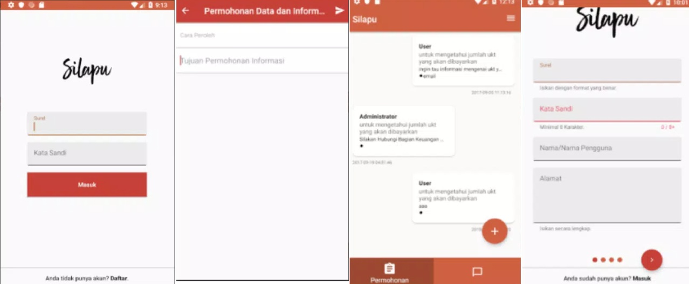

- [X] Server Dead 
- [X] Obsolote / Removed from Google Play
- [X] [Latest version on Jul 14, 2022](https://apkpure.com/id/layanan-dan-pengaduan-ulm-2-0/com.unlam.humas.silapu)
- [X] Release on 4.2++ Android Version

## Official Description

The Mobile Service and Complaint Application is an Android-based application that can be downloaded by students or the general public who want to request data services or submit complaints to Lambung Mangkurat University. Previously, the process of requesting services and submitting complaints was done by going directly to Lambung Mangkurat University or accessing the web page http://silapu.ulm.ac.id. Silapu Mobile provides a new way to request services and submit complaints. With the rapid development of Android applications, one way to simplify the process of requesting and submitting complaints is to use only the smartphone required by the user.

## Breakdown

This project handed down to us by one of my lecturer, they need Android app to submit complaint from anyone who had problem with the system. We are two-person team, one act as Product Manager and me working as the Android Engineer.

We use their official API to fetch data and submit complaint. At the time I'm still using Java, since Kotlin hasn't been officially supported (I think).

Few features we implement including,
1. Login/Register Page
2. Submit Complaint
3. Chat 
4. Notification

## Repository

::github{repo="miftahulmuhaemen/silapu_ptik"}