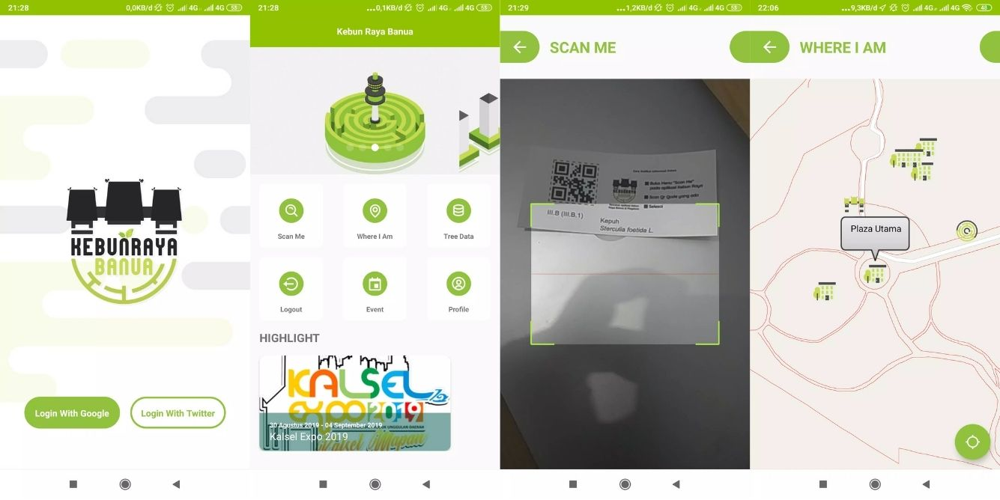
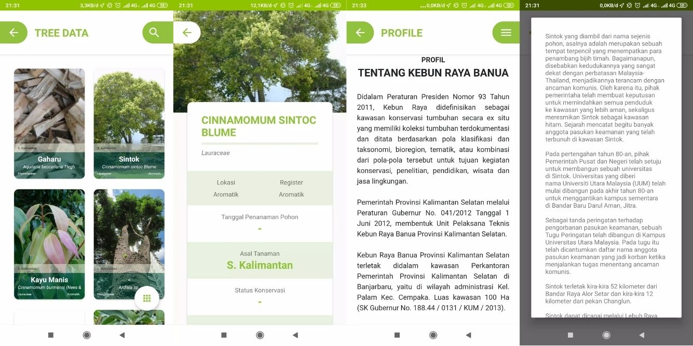

- [X] Server Dead 
- [X] Obsolote / Removed from Google Play
- [X] [Latest version on May 30, 2022](https://apkpure.com/id/kebun-raya-banua/com.iqromaya.kebunrayabanua)
- [X] Release on 5.0++ Android Version

## Official Description

This application was built with the aim of introducing the plant collection owned by the South Kalimantan Banua Botanical Garden. All plant collections owned by the Banua Botanical Garden are recorded electronically and can be accessed by visitors while inside the garden area or online.

## Breakdown

Official request come thru my lecturer, they want to make an app for Kebun Raya Banua (a local big garden with public access). So he invite me to join the project along with one designer and complete it around three month including the fixes and adjustable request from the client.

Few features we implement including,
1. Login with Google/Twitter SSO
2. Tree Data (only available in the garden)
3. Scan QR code to identify the specific tree on the spot 
4. Pinpoint location "Where I am"

## Repository

::github{repo="miftahulmuhaemen/KebunRayaBanua"}