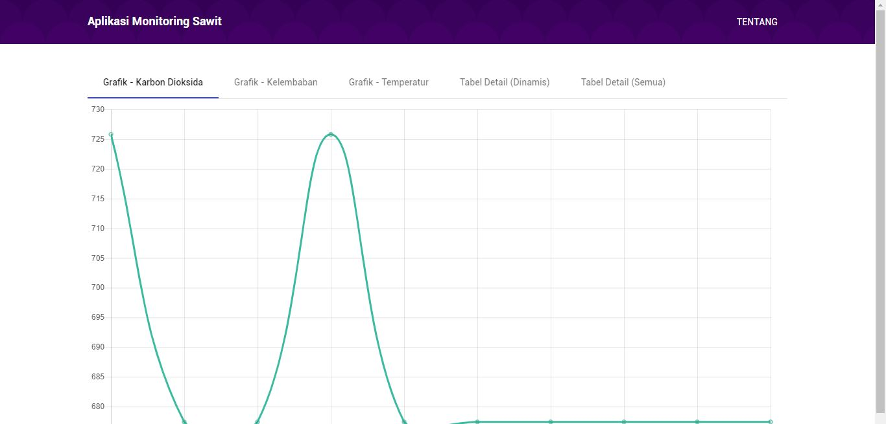

- [X] Server Dead 
- [X] Obsolote
- [X] Deployed on Google Cloud Platform at the time

## Official Description

An application to monitor real-time data transferred by IOT on oil palm plantation. There are many variables sends each second by multiple sensors, aggrigated and visualized on the website, which help operator on-site to make a decision and action if there are a needs for it.

## Breakdown

Me and my friend from Physics Major participate in an event and my friend in charge to build a tool full of sensors to detect tons of variable around palm oil plantation. While I'm in charge to build a website to visualize the data. We won 2nd place and sent to many places in Indonesia.

I deployed it on Google Cloud Platform at the time because I have free credit unused and it would be cool to utilzie GCP rather than buying server host somewhere.

Few features we implement including,
1. Real-time data visualization 

## 2nd Place Winner Certificate

::link{url="https://drive.google.com/file/d/1RMV5kzOQ-lk4KZhtcypHw8j4G9Uoh_nX/view?usp=sharing"}

## Repository

::github{repo="miftahulmuhaemen/Monitoring-Sawit"}