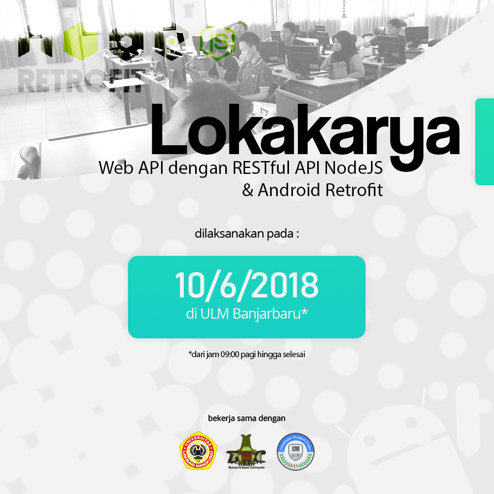

## Official Description

Google Developer Student Club (GDSC) is a program inisiated by Google in order to spread the knowledge of Google's technology to the students. It is a club that is run by students for students. It is a great way to learn and share knowledge with other students.

## Breakdown

I lead the GDSC ULM as a Lead for a year. I was responsible for leading the club and managing the club's activities. Me, my seniors, friends and underclassmen are the members of the club, we together learn new things at least once per month, more if we have a project to work on.