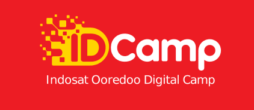

## Official Description
This scholarship program is organized by Indosat Ooredoo Hutchison as part of the Digital Education pillar in its Corporate Social Responsibility initiative, aiming to produce Indonesian digital talent ready to compete and build the nation towards a Digital Nation.

In 2025, IDCamp focuses on Artificial Intelligence with two main categories: AI Development and AI Integration, totaling eight learning paths. This includes two new paths: AI Engineer and Generative AI Engineer.

The main IDCamp curriculum is developed by Dicoding as a Google Authorized Training Partner, featuring industry-based use cases to ensure participants' skills are directly applicable in the workforce.

## Breakdown

I was an alumni at Dicoding for more than one category, then I got invitation to become a Facilitator at this program. My job was to help the students to tackle problem they couldn't solve by themselves as the curiculum itself is sufficient for many but those who had problem needed help to unstuck, me and my peers helps them.

