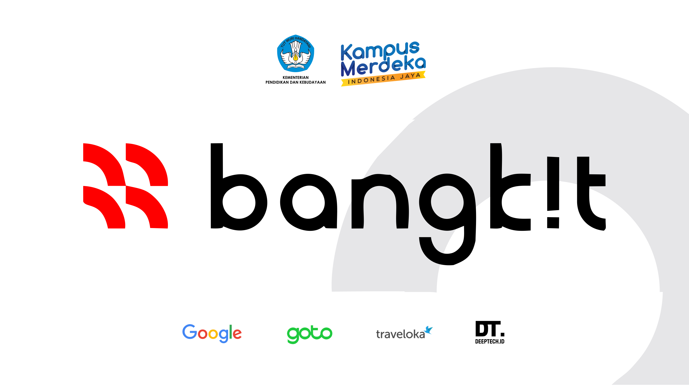

## Official Description
Bangkit is an intensive, 900-hour career readiness program led by Google, GoTo, and Traveloka to train Indonesian students for high-demand digital tech roles. It offers three learning paths—Machine Learning, Mobile Development, and Cloud Computing—integrated with soft skills and industry certifications. Part of the Kampus Merdeka, it provides free training for students, aiming to boost technical, professional, and AI-related skills. 

## Breakdown

As an alumni from GDSC, Dicoding, and also work in the industry, I was invited to become a Advisor at this program, the technicality is exactly the same as IDcamp, however, there are few extra tasks per se for the students, to be more precise, they need to finish a project called Capstone, to implement what they've learn and form a team of three.

