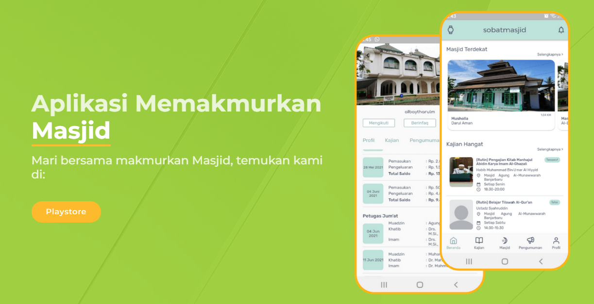

- [X] Server Status Unclear, but the app no longer on the playstore 
- [X] At the time actively used by hundreds of users and properly monitored by few organization because the startup got the funding 
- [X] Obsolete

::link{url="https://sobatmasjid.com/"}

## Breakdown

As an Android Engineer, I developed Sobat Masjid, a mobile application built with Kotlin for the Android platform. The app serves as a community tool to support mosque-related activities and other related events by the owner of the app.
