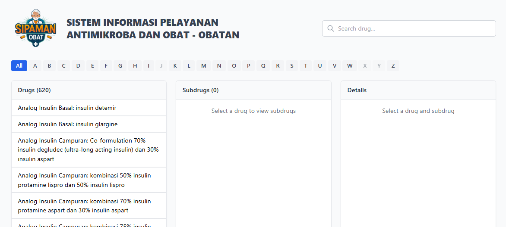

- [X] Server Alive

::link{url="https://sipamanobat.my.id/"}

## Breakdown

Sipamanobat is a drugstore glossary web application. It provides a searchable catalog of pharmaceutical products with data collected through scrapping. The frontend is built with React while the data pipeline uses Python Notebook for scrapping and processing.

## Repository

::github{repo="miftahulmuhaemen/drugstore-glossary"}