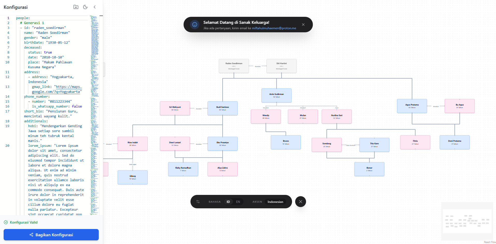

- [X] Server Alive

::link{url="https://sanak.muhaemen.my.id/"}

## Breakdown

Sanak is an interactive family tree web application built with React. It allows users to visualize and navigate through family relationships in an intuitive interface.

## Repository

::github{repo="miftahulmuhaemen/family-tree"}
